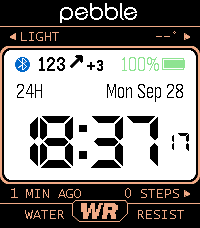
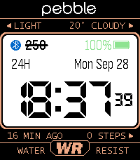
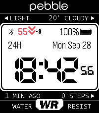

# 91 Dub CGM (dubv4cgm)

The classic **91 Dub** watchface for the **Pebble Time 2** – with a
**Nightscout CGM** value, weather, health data and the RGB backlight.

A fork of [91 Dub v5 plus](https://codeberg.org/dflo/91-dub-v5-plus) by dflo
(itself a fork of [91 Dub v5](https://codeberg.org/lightrush/91-dub-v5) by lightrush),
based on the great [91 Dub v4.0](https://github.com/orviwan/91-dub-4.0) by Orviwan.

| In range | Stale reading | Low, theme "91 Dub v2.0" |
|---|---|---|
|  |  |  |

## Features

- **CGM** in the panel's top row: value, trend arrow, delta
  - high / low values in their own colours, stale values struck through
  - optional vibration on low / high (every 10 min at most)
  - optional: **backlight lights up in the high / low colour** (Pebble Time 2 RGB backlight)
  - mg/dL or mmol/L, sensor interval 5 min or 1 min
  - battery-friendly fetching: synced to the reading's timestamp with a
    learned upload delay, watchdog if the phone's timer dies
    (same logic as [CasioCGM](https://github.com/sgitaize/casiocgm) and
    [Nightscout-supercgm](https://github.com/sgitaize/Nightscout-supercgm))
- **Four edge labels** (LIGHT / PREV / NEXT / bottom left) can show:
  original label, CGM value, CGM age, weather, steps, heart rate, battery
- **Weather** from [Open-Meteo](https://open-meteo.com) (no API key), °C / °F
- Everything from 91 Dub v5 plus: steps / sleep, heart rate, 3 digital fonts,
  anti-aliasing, 2 colour sets (switch by time or tap), 90+ themes,
  custom backlight colour, power save, left-handed mode …
- Settings page on GitHub Pages: https://sgitaize.github.io/dubv4cgm/config/
  (settings travel in the URL fragment – your Nightscout token never reaches a server)

## Nightscout

Enter your site URL (e.g. `https://my-site.herokuapp.com`) and, if your site
needs one, a token with read access. The watchface uses the `/pebble` endpoint.

## Building

```bash
npm install
pebble build          # after changing messageKeys: pebble clean first
pebble install --emulator emery
```

Technical notes for contributors: [AGENTS.md](AGENTS.md).

## License

MIT-style, see [LICENSE](LICENSE). Fonts keep their own licenses.

This is a hobby project, **not a medical device**. Do not make treatment
decisions based on this watchface.
